# fred build queue log

Reports for each item in QUEUE.md, newest last.


## Item 1 · fred v3 ("soft minimal") + all queued behavior changes — DONE 2026-09-29

**Branch** queue/1-v3-soft-minimal, merged to main. Commits: v3-0 tokens and shared components · v3-0b input outlines reach 3:1 · v3-1 header and navigation · v3-2 Plan in four open sections · v3-3 Results as a prep checklist · v3-4 Journal timeline · v3-5 Volume layout 5 · v3-6 Races with graffiti · v3-7 Log a race cards and Ready, Freddy · v3-8 Settings as a searchable list · v3-9 races table frame, colours frozen · v3-10 restyle remaining screens · v3-11 quality pass. sw.js cache fred-shell-v26 (the marker fonts are precached for offline use). No Worker changes.

### What changed
Every screen now uses the soft-minimal system from the spec: #FAFAFA page, white panels with thin outlines, light-weight numbers, one tinted panel per page, no solid colour blocks, no shadows (except the selected segment). Header is a large left title with a grey subline; the nav reads Plan · Journal · Volume · Races · Settings. Plan shows four open sections with the Ride panel tinted in the effort colour. Results is a ride-morning checklist (Bottles / Gels / Closet ticks that save with the plan and sync) with a plain-sentence Copy. Journal is a timeline with the waiting check-in tinted, a Copy of what you actually took in, and "What fred noticed" built only from checked-in rides. Volume has the blue season card, four same-day tiles, and an Hours-per-year chart that scrolls sideways back to your oldest season. Races opens with your last race in marker "graffiti" (Permanent Marker + Caveat Brush, self-hosted in assets/fonts with their licenses) and the one coloured Your bests card. Log a race uses tinted leg cards and ends on Ready, Freddy. Settings is one searchable list with coloured lines and sheets. The races table keeps its spreadsheet colours (now guarded by a test). The build-9 behaviours (Plan → Journal, digits-only times, auto halves, no wins while logging, placings order, nutrition-only carbs, off-season on a date) were kept and restyled.

### Decisions
The spec left some choices open. Where the PDF and the quality rules disagreed, accessibility won (these are marked "D:").

## Parts 0–1 (690ad7f, 88fb916)
- Tokens + shared components (tinted panel, input/collapsible sections w/ per-device fold state bluebird.fold.v1 not synced, timeline, delta pills w/ Less flip, segmented, chips, checkbox rows, auto field). Shadows removed except selected segment.
- Header: large left title + grey subline (ride date on Plan results; offline state), account circle; scrolls with the page (iOS large-title style). Nav: Plan · Journal · Volume · Races · Settings (data-view="profile" and ids kept). theme-color/manifest #FAFAFA.
- D: inactive tab LABELS #6E6E73 (icons #B5B5BA) — #B5B5BA text fails AA.
- D: dark text on tints: blue #0B7399 and teal #147574 instead of #127EA6/#1F8F8E (those fail 4.5:1 on their tints); green #5F6A12 kept.
- D: unselected segment text #3A3A3C (#6E6E73 on #F0F0F2 is 4.46:1).
- D: input outlines #8E8E93 (3.26:1) instead of #E5E5EA (1.26:1): the spec's own quality page requires 3:1 input outlines (fixed in v3-0b).
- D: product names 14px (spec allows 14–15) to avoid overflow at 320px/200%.
## Part 2 (636963e v3-0b, 4a1db31 v3-2)
- Four open sections; Ride tinted by effort (recovery→teal, z2 Steady→blue, hard→green; stored values unchanged).
- D: former folded Plan inputs made visible: typed temperature under Where & when; bottle size, fluid, strength, first gel, heat option, "I know what I like" under Today & bike ("Fine-tune today"), because nothing may hide behind a tap. Today & bike is therefore longer than the PDF.
- D: Nutrition / Clothing / Both switch kept as "Plan for" in Today & bike (not in PDF; needed for Clothing mode).
- D: old "Your setup" summary → "From Settings" block with "Edit in Settings".
- D: Date · Start · Ends share one row only where they fit (430px); narrower phones put Date on its own row (native date box is wider than the PDF's custom "Sat, Sep 26").
- D: chips/outlined buttons keep the light #E5E5EA edge (identified by their text); field boundaries #8E8E93.
## Part 3 (93e7191) — full kit after part 3: 53/54 OK; strava-sync failed only because its fixture's newest ride (2026-09-27) fell outside the sync window as the calendar moved — fixture fixed, passes standalone on old and new code.
- Results as a prep checklist: tinted top numbers (effort colour), small static weather card (sky gradients/animations removed), Bottles/Gels/Closet tick rows (ticks in lastPlan.ticks, which syncs; keyed by item so re-crunch keeps ticks for unchanged items; included in the Journal snapshot as snap.ticks), During the ride, Nutrition totals + Copy, Details, Save bar.
- D: warnings sit right under the top numbers (red text on white) so folding Bottles can't hide them.
- D: everything else from the old Results is in Details (leg-by-leg bottles, hourly weather + full "how it changed", gel schedule, numbers by hour, math, notes, Log this ride, Save as image).
- D: weather card's big number is the ride-start temperature with "→ X° by {end}"; the top panel keeps the ride average.
- D: water-only / aid-table refills show as a plain line in Bottles (nothing to pack, no tick box).
- D: kcal = rounded carbs × 4 so card and Copy agree; metric Copy says mL; clauses omitted when they don't apply; "1 gel" singular.
- D: top-number stats 26–34px light (spec scale gave 23.8px, visibly smaller than the PDF).
## Part 4 (v3-4 journal timeline)
- Timeline: upcoming (hollow, furthest ahead first) → check-ins waiting (newest first) → done (newest first). Groups implicit; "N rides · K waiting" count line kept (#journalCount); sr-only "waiting for a check-in".
- D: only the newest waiting check-in is tinted; older waiting ones get teal outline + button (one tint per page).
- D: races are not journal entries today → no black dots added.
- D: planned entries' numbers line "Planned 85 g/hr" (upcoming too; PDF shows none for upcoming); Strava match "Strava 4:18, 71.2 mi".
- D: tag meaning: good = Strong, Stomach great; rough = Faded, Stomach upset, Lots of gas, Too thirsty, Sloshy; neutral = the rest incl. clothes verdicts (PDF shows "Too warm" in ink). Tag words unchanged (JTAG).
- D: 24-hour phones get "08:00" (2-digit hour); 12-hour keep "8:00 AM".
- D: Copy in the opened entry (Copy · Edit entry · Delete + "Copies: …" line); none on Clothing-only entries. Conc from snapshot (old: plan.actualConc) only when bottles were finished; caffeine = caffeine gels actually reached in schedule order with ride times; old entries: planned mg only if every planned gel taken, no time.
- What fred noticed: ≥3 rides per line (J_NOTICE_MIN); lines intake vs plan, energy, stomach, thirst, clothes vs temp (items worn on ≥half the too-warm/too-cold rides); Done + not future only; fold key jNoticed, closed by default.
- D: open entry's full log spans the full width (thread pauses under it); plan-vs-actual table scrolls in its own box at 200% on ≤375px.
- Check-in sheet ticks read-only: not added.
## Part 4 (4f952a3)
- Journal as a timeline: upcoming (hollow dots, furthest first) → waiting check-ins → done, newest first; count line "N rides · N waiting" replaces group headings (hidden SR label on waiting rides).
- D: only the newest waiting ride is tinted (teal); older waiting rides get a teal outline + button (keeps one tint per page).
- D: races are not journal entries today, so no black race dots.
- D: tag colours — good (Strong, Stomach great) #5F6A12; rough (Faded, Upset, Lots of gas, Too thirsty, Sloshy) #C21A2F; everything else ink, clothes answers neutral as in the PDF.
- D: 24-hour phones show "08:00"; 12-hour phones "8:00 AM".
- D: Copy is inside the opened entry; clothing-only rides have no Copy; concentration only when bottles were finished; caffeine = caffeine gels actually taken, with ride times from the snapshot; metric in mL.
- D: "What fred noticed": 5 patterns (intake vs plan, energy, stomach, thirst vs fluid, clothes vs temperature = closet learning), each needs ≥3 checked-in rides answering it; planned entries never count. Collapsed by default, remembered.
## Part 5 (9986875)
- Volume layout 5; four tiles with same-day comparisons in the pure maths block (volTiles).
- D: new "Weeks start on Monday | Sunday" choice in the goal sheet (Monday default), needed for same-days-of-last-week.
- D: "5-week average" = the last 5 full weeks including last week.
- D: with no goal, Avg/week compares with last season's average week; "goal reached" when reached.
- D: Hours ▾ sits on the Season | Off-season row (doesn't fit on the chip row at 390px); More became a ⋯ icon on the sync line.
- D: year chart: ≤8 seasons share the width; >8 → 44px slots (34 bar + 10 gap), opens at the right end, shared y-scale, fades + "‹ oldest" hint, snap, popover, ←/→/Home/End; the two edge fades are the only gradients in the app.
- D: Strava orange #FC4C02 added as a token, used only for the sync-line dot shown in the PDF.
- D: Volume tables stack instead of scrolling when narrower than 15rem, so only the year chart scrolls sideways.
## Part 6 (99d84df)
- Races: last race card (grey outline) with marker graffiti, Your bests = only tinted card (teal/blue/green tints), buttons, collapsible lists (All races by year, Chapters, dashed AI card).
- Fonts self-hosted in assets/fonts: Caveat Brush (OFL) and Permanent Marker (NOTE: Permanent Marker is licensed Apache-2.0, not OFL — the real Apache license file is shipped).
- D: note from the top selected win: overall PR that is a first sub-X → "first sub-X, baby!"; other overall PR → "PR by M:SS!"; AG overall PR → "AG PR by M:SS!"; anything else → no circle, "Finished. Race #N of the season." (N = order among finished races in that calendar year).
- D: animation once per device (bluebird.graffitiSeen.v1), only for races saved after this device first showed the page; JSON/spreadsheet imports never animate; reduced motion uses up the play statically; a race synced in from another device may play once here.
- D: #raceImportBtn lives inside the dashed AI card (or the empty-state AI card).
- D: sections not in the PDF: distance cards + Records across distances → folded "Records by distance"; Firsts since / Compare to before → folded "Firsts since {chapter}" (chapter view); upcoming races at the top of All races; landscape card at the foot of All races.
- D: All races shows 8 results then "Show all N ›"; PR badge = beat every earlier eligible finish at that distance (first race at a distance gets none).
- D: chapter dots replace the chapter icon in the switch/list (icon still stored); AI card keeps "Copy prompt" wording (verbatim AI card text).
- D: last race and Your bests cards don't collapse (the PDF draws carets but the text doesn't ask for it).
## Part 7 (a481985) — full kit after part 7: 58/58 OK
- Log a race cards as light tints (grey/teal/blue/green) with outlines; header "Cancel · race", dots, ← + "Next: …"; Ready, Freddy with marker title, graffiti, every win with tick boxes, found-with-fred switch, Copy N wins, Done.
- D: How it felt is card 9 and Build card 10 (PDF shows "Next: How it felt" after Nutrition).
- D: Overview keeps editable race-day weather (air temp, humidity, wind + Fill in); water temp moved to Swim; Finish shows a read-only summary.
- D: kept fields the PDF doesn't draw (swim unit chips, bike half power, power-meter switch, Anything off? on bike/run, course, notes, the other nutrition planning fields under "The days before and the plan").
- D: race weight moved to Finish (same saved field); Finish "Age group" is the as-listed field with the birthday band as placeholder.
- D: a "Save & finish" outlined button under every card so saving early stays possible; Skip hidden (Next does the same).
- D: the graffiti animation now plays once on Ready, Freddy, then the race is marked seen so the Races card shows it static.
- D: Ready screen trimmed to the PDF (no medal/reorder/add-your-own; those remain on race detail); wins shown without emoji, Copy keeps full lines.
## Part 8 (c196aa5)
- Settings: flat searchable list with coloured group lines; one sheet opens each setting's existing editor (ids/handlers kept); Recently changed = last 3 per device (bluebird.settingsRecent.v1, not synced/backed up); deep links open their sheet; old accordion state key removed at boot (held no user data).
- D: items not in the PDF list went into the closest sheet with search keywords: Medications → Caffeine; bottle size + Advanced (caps, heat thresholds, gel rounding) → Drink mix; brand filter + Fine-tune → Gels; Import race spreadsheet → Backup.
- D: Counts toward volume opens the Volume goal sheet at its sports chips (the only place they are edited).
- D: Gender labels Women / Men / Non-binary (stored values unchanged).
- D: search field uses the grey tint fill + 3:1 outline (the #F0F0F2 fill gave the placeholder only 4.46:1).
- D: the sheet stops at the tab bar so tabs stay usable.
- Leftover "Profile" wording app-wide now says Settings.
## Parts 9–10 (198543d v3-9, 549e23e v3-10)
- Table: frame only (page #FAFAFA, rounded white frame with 1.5px outline, "‹ Races" + 17/600 title, chips, Time|Pace v-seg, lighter headers, legend). D: selected filter chip black (part 0 / brief) though the PDF text says "white selected chip" (white-on-white fails the 3:1 state contrast). D: CdA legend note kept.
- table-colors.test.js freezes DEW/WKG/NEG/GROUPS (source + runtime + rendered cells + legend + Pace mode) and the --brand dot.
- D: coloured ACTION buttons allowed (teal "How did it go?"); coloured SELECTED toggles are blocks (cage roles, closet efforts restyled as segmented with dots).
- D: race detail hero = its one tint (blue); Compare summary grey tint (green when faster); Settings has no tint (spec p.11).
- D: Journal ± column: more than planned = green pill, less = red, no change / time = grey pill.
- D: no in-app splash exists; launch splash is the manifest (#FAFAFA + icon, part 1).
- D: email ellipsizes at 320px/200% on the account sheet.
## Parts 9–10 (198543d, 549e23e)
- Table: frame restyled only; frozen cell colours guarded by work-v3/table-colors.test.js (source constants + rendered cells + header bands; verified it fails when a colour changes).
- D: selected filter chip is black (the PDF text says "white selected chip", but white-on-white fails the 3:1 a selected state needs).
- D: coloured action buttons allowed (the PDF's teal "How did it go?"); coloured SELECTED chips/segments count as solid blocks, so cage roles and closet efforts became segmented controls with colour dots.
- D: race detail top card = its page's one tint (blue); Compare summary = grey tint (green when faster); Settings has no tint (spec p.11).
- D: Journal ± column uses delta pills (more than planned green, less red, no change grey).
- D: no in-app splash exists; the launch splash is the manifest (#FAFAFA + icon).
- D: Strava callback page restyled with the same tokens inline; behaviour and version line unchanged.
- New guards in fred accept: no solid palette-colour blocks outside buttons/dots/charts/pills/table cells/logo/Strava artwork; exactly one tinted panel on Plan, Results, Journal, Races; none on Settings.
## Part 11 (v3-11 quality pass) — full kit after part 11: 63/63 lines OK
- Motion: removed the Results "rise" card animation and the old bottle-fill transition; smooth scrollIntoView (5 places) now jumps instantly. Allowed: graffiti draw/pop (once), toast opacity fade (re-enabled with its own rule), .v-caret rotation. One reduced-motion block at the end of the stylesheet stops every animation/transition.
- D: the race-import spinner (.ri-busy) and the location button's busy pulse (.loc-me) are loading feedback: kept, static under reduced motion. Strava callback spinner likewise (already gated).
- D: smooth scrolling counts as motion → instant jumps everywhere, also without reduced motion.
- Light only: color-scheme: light (meta + :root) on index.html and strava/callback; no prefers-color-scheme rules existed.
- sw.js: fred-shell-v26; precaches both marker fonts by explicit name.
- Layout test now derives its list from screens.js (it had missed results-checklist-open); runall2 runs the full 4×3 matrix (one width per process, in parallel).


### Tests
Full kit (runall2.sh) run after parts 3, 7 and 11. After part 3: 53/54 (strava-sync failed only because the calendar moved its test ride outside the sync window; fixture fixed). After part 7: 58/58 OK. After part 11 (final): **all 63 lines OK**, including contrast AA on 78 screens (12,351 checks), the full layout matrix 320/375/390/430 × 100/150/200% on every screen (900 checks), the Volume matrix, the sync suite, the Strava tests, the frozen table colours, motion (only graffiti once, toasts and carets; nothing under reduced motion) and light-mode-only. New v3 tests: part0-1, plan, results, journal, volume, races, lograce, settings, table-colors, motion, light.

### Screens next to the PDF (app at 390px on the left, PDF page on the right)

**p2 · Design system**

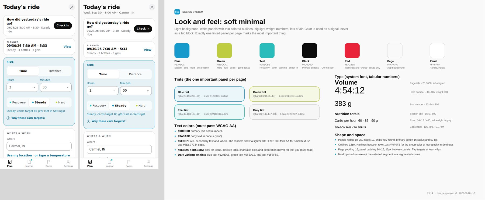

**p3 · Components**

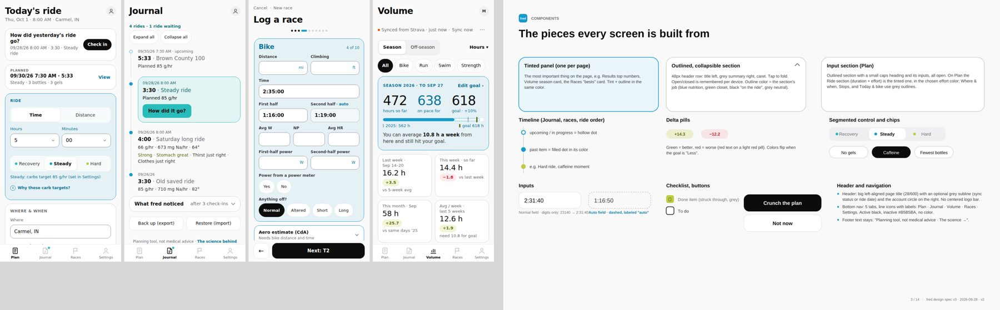

**p4 · Plan**

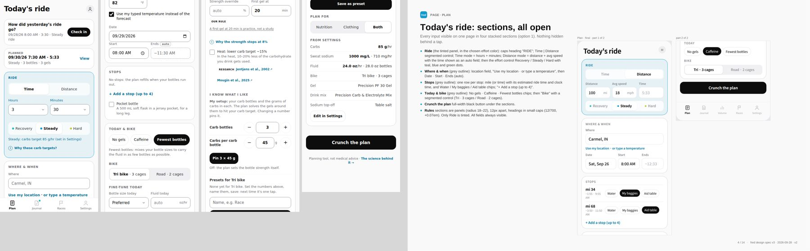

**p5 · Results**

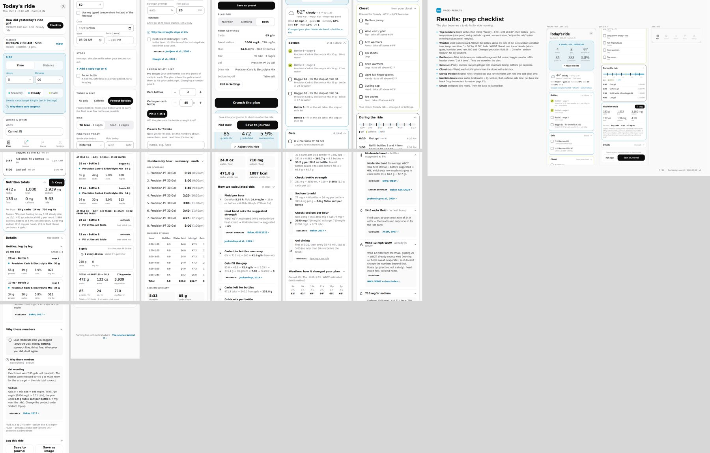

**p6 · Journal**

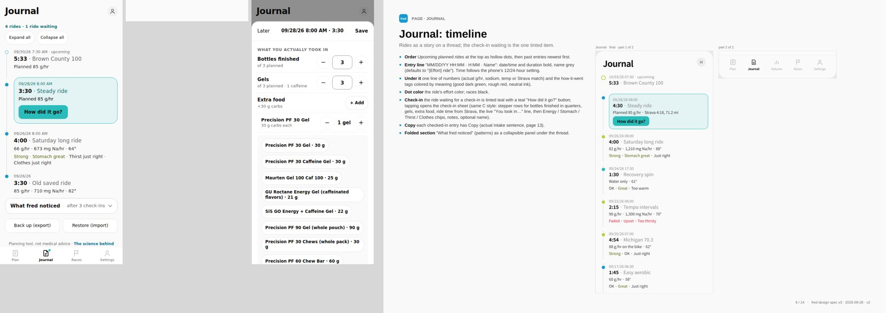

**p7 · Volume**

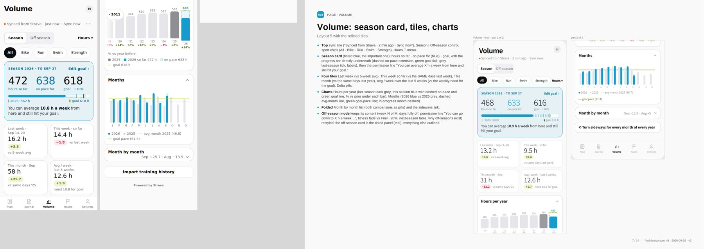

**p8 · Races**

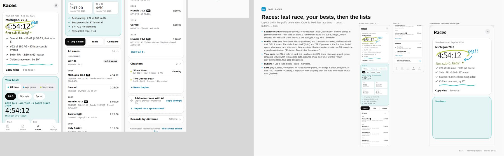

**p9 · Log a race (1 of 2)**

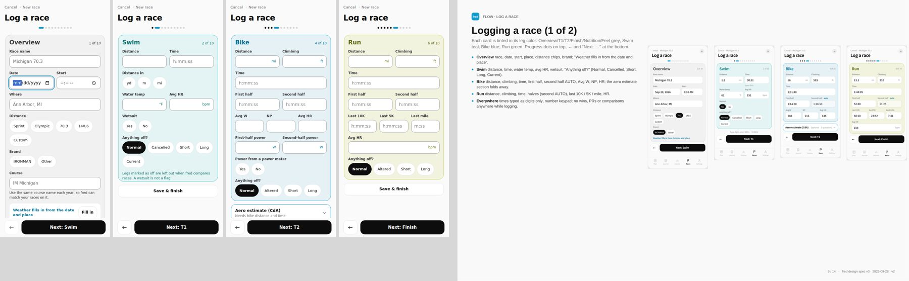

**p10 · Log a race (2 of 2) + Ready, Freddy**

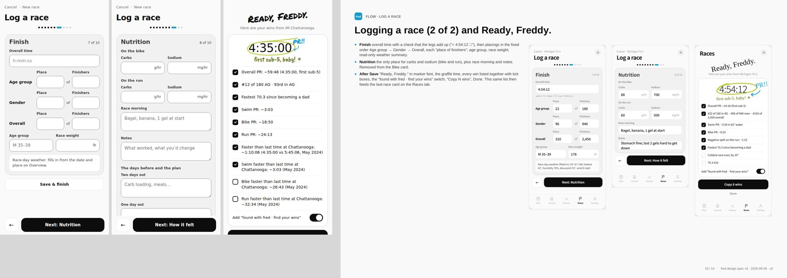

**p11 · Settings**

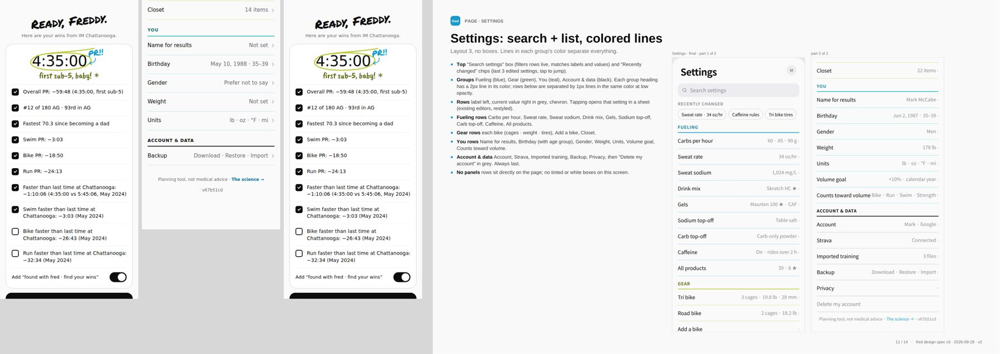

**p12 · All races table**

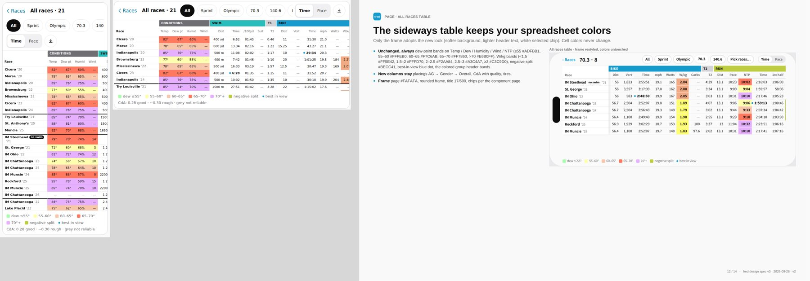

## Item 2 · Import training history: pick the right sheet in Excel files — DONE 2026-09-29

**Branch** queue/2-xlsx-sheet, merged to main. Commits: "q2: pick the right sheet in Excel training imports", "q2: cache fred-shell-v27".

### What changed
- An .xlsx training file is no longer read from its first sheet only. fred looks at every sheet, finds each sheet's header row (up to 15 rows down, so notes above the table are fine), and picks the sheet itself, or asks "Which sheet?" when it can't be sure.
- The "Which sheet?" step (step 1 · Files) lists each sheet with its row count and detected format, best guess pre-selected; Back / Next.
- Column dropdowns are pre-filled by header name, ignoring case, spaces and "_": Date/WorkoutDay → date, Sport/WorkoutType → sport, Hours/TimeTotalInHours → hours, Meters/DistanceInMeters → distance, Title → title. The older looser guesses stay as a fallback.
- The race-spreadsheet importer is unchanged (it shares only the file loader, which was not changed).

### Decisions
1. Sheet rule: each sheet gets a tier: 2 = a known format (TrainingPeaks, Strava, Garmin), 1 = fred can find a date plus a duration or distance column, 0 = any other table. Hidden sheets and sheets with no data rows are skipped. One sheet in the best tier wins outright. Two or more known-format sheets → ask. Otherwise the sheet with the most rows wins unless the runner-up has at least 80% as many rows → ask.
2. A table fred can map beats a bigger one it can't (row count only breaks ties within a tier), so a big notes or summary sheet never wins over the workout log.
3. Hidden sheets are skipped unless nothing else has data (exports often keep helper data there).
4. Known formats still go straight to the preview (as before); only other layouts reach the column step.
5. The picker lists every candidate sheet, ranked, so the choice can always be overridden.
6. A header row needs at least 2 text cells and at least half as many as the widest row, so notes lines like "Athlete: | Ashley" are skipped; a known-format row is taken first even under notes.

### Tests
New xlsx-sheet test (38 checks) with real .xlsx fixtures: a "Read me" notes sheet first and TrainingPeaks data on "Workouts" (picked automatically, imported correctly); two plausible sheets (picker, then pre-filled columns); generic headers on sheet 2 (picked by most rows, pre-filled); header row under two notes rows; CSV unchanged. The picker was added to the contrast and layout screens. Full kit: every line OK except one known intermittent check in the races-flow test ("closing with typed data asks first"), which failed once under the full parallel run and passed 3 times out of 3 when rerun on its own; it is timing-related and unrelated to this change.

## Item 3 · Bug: imported training + Strava double-count the same workouts — DONE 2026-09-30 (one step needs Ashley's device, see below)

**Branch** queue/3-double-count, merged to main. Commits: "q3: count each real workout once across imported training and Strava", "q3: cache fred-shell-v28".

### Diagnosis: what was actually wrong
The de-duplication *did* run whenever Volume was computed (`volActs()` → `volMergeActs(sa, imp)`, main index.html:12146 and :5213), and it *did* use Strava's local date (`start_date_local`, :5214). So the dates, the sport tables and the "compute time vs import time" question were not the cause. The matching rule itself was too narrow, and it also merged too much in one case. main index.html:5213–5221:

```js
const close=(x,y)=>Math.abs(x-y)<=0.1*Math.max(x,y) …
if(c.some(a=>w.hours!=null ? close(volHours(a), w.hours) : (w.meters>0 && close(+a.distance||0, w.meters)))){ dropped++; return; }
```

1. **It compared against Strava's moving time only** (`volHours(a)` is `moving_time`, :5176). TrainingPeaks' `TimeTotalInHours` is usually elapsed time, so any workout with stops (long rides, pool swims, runs with lights) was more than 10% apart and got counted twice. This was the main cause.
2. **There was no 5-minute floor.** Short sessions (a 30-minute run with 26 minutes moving is 13% off) never matched.
3. **Distance was only used when the imported row had no time.** A row with a time and a matching distance but a time more than 10% off was never checked by distance.
4. **Swims with an estimated time** were compared on their guessed time and missed.
5. **No ±1 day.** A late-evening workout that TrainingPeaks files on the next day (a different time zone setting, or a ride that crosses midnight) never matched.
6. **Not one-to-one.** `c.some(…)` let one Strava activity absorb *every* close imported row, so an AM + PM run (or two similar rows) with one Strava run lost the second run's hours. This is an under-count.
7. The memo (`key=sa.length|TI.ver|lastSync|uid`, :12147) was **not** a cause in practice: every import bumps `TI.ver`, and every sync changes the size or `lastSync`. It only went stale during a sync when an activity was edited in place (same count). It is now keyed on the contents anyway (see the fix).
8. `tiSame` (the 10% rule, :12102) compares imported rows with other imported rows at import time only (the same workout in two files). It never saw Strava data, so it was not involved in this bug. Left as is (see decision 9).

Reproduction: `kit/work-q3/repro.js <html>` runs 10 seeded cases plus an order check through a build's pure Volume block. On main, 6 are BAD: C elapsed 5:02 vs moving 4:12, D short run, E estimated swim, F distance agrees but time does not, G AM + PM runs (both absorbed, 1 h instead of 1.98 h), J 23:10 start filed next day. The spec's own example (A: TP 2.0 h vs moving 1:58) and the UTC-next-day case (B) already matched on main. With the fix, all 10 are OK.

### Fix
- `volMergeActs` (pure Volume block, next to `volHalfUp`) is rewritten with `VOL_MATCH={pct:.10, floor:300 s, dist:.10, edge:180 min}`, `volLocal`, `volPairGap` and `volSources`. The rule is the one in QUEUE.md: same sport group, same local date, and either the duration within max(10%, 5 min) of moving **or** elapsed, or (when both have one) the distance within 10%. A swim flagged `est` pairs on distance alone. Pairing is one-to-one, closest first, and the Strava activity is the one counted. Imported rows are never deleted; a matched row is only left out of the maths.
- `volActs()` now goes through `volMerged()`. Its memo key is an order-free hash of each activity's id, sport, local start, moving and elapsed time, distance and manual flag, plus `TI.ver` and the imported count. The merge is recomputed on any content change.
- Import stores `est:true` on swims whose title contains "time estimated" (any case). Backup and restore keep the flag.
- Settings › Imported training shows "6,034 imported · N matched to Strava and counted once." (real numbers, thousands commas) when signed in with Strava connected and synced, otherwise "N imported". The import toast, preview count and file list now use thousands commas too.
- **Sources** sheet: open it by tapping the Last week, This week or This month tile (the whole tile is the button, with a small ›), or any month in Month by month. It lists that period's workouts, oldest first: date, sport, duration, distance and source ("Strava", "Imported", "Strava · also imported, counted once"). Each merged imported row sits indented under its Strava activity as "Imported · counted once with Strava ride", with its own time. The header reads "N workouts · X h counted · M imported counted once with Strava". The sheet follows the sport chip, shows "Powered by Strava" when Strava rows show, and is read-only. Nothing is stored; it is owner-only (the Volume tab).

### Decisions
1. **±1 day** is only a fallback. It applies after every same-day pair is taken, and only when the Strava activity started within 3 h of midnight in local time: 21:00 or later means the imported day may be the next day, before 03:00 the day before. It also applies, either way, when the activity has no `start_date_local`. Imported rows never have a time of day, so the literal rule ("one side has no time of day") would allow ±1 always. That would pair Monday's run with Tuesday's for anyone who trains daily. A same-day candidate always wins over a ±1 one.
2. **Tolerance**: max(10% of Strava's time, 5 min), checked against moving and against elapsed separately. The distance tolerance is 10% of Strava's distance.
3. **"Closest"** means: a Strava-id pair (from a Strava bulk export) first; then same day before ±1; then the smaller of the larger relative gap across time (the better of moving and elapsed) and distance, each counted only where both sides have it. Ties go to the distance gap, then the ids, so the result never depends on list order. In the synthetic history, ranking by the larger gap instead of time first cut wrong AM/PM swaps from 35 to 4, and the 4 left are genuinely indistinguishable.
4. **Sport groups** use the existing tables; no counting change. Strava (VOL_SPORT): Ride, VirtualRide, GravelRide, MountainBikeRide → bike; Run, TrailRun, VirtualRun → run; Swim → swim; WeightTraining, Workout, Crossfit → strength; everything else (EBikeRide, Walk, Hike, Yoga, Rowing…) → other. Imported (tiSport): Bike, MTB, Mountain Bike, Cycling, Ride, Gravel, Spin → bike; Run, Jog → run; Swim → swim; Strength, Weight, Crossfit, Gym, Lift → strength; Brick, Multisport, Triathlon, E-bike, Walk, Crosstrain, Other… → other; Day Off → skipped. Only the same group pairs, so an e-bike ride is "other" on both sides and pairs only with "other".
5. **"Time estimated"** applies to swims only (the rule names swims). An estimated swim with no distance never pairs. Rows imported before this change have no `est` flag, but they still pair through the general distance rule, so only the ranking differs. Re-importing the same file adds nothing, because the ids already exist.
6. **The counted time is the Strava activity's** (moving time, or elapsed for manual entries, as before), on Strava's local day.
7. **Sources entry points** are the week and month tiles and the Month by month rows. The Hours-per-year popover (a whole season) and off-season mode have no Sources entry.
8. **The Settings line** needs signed in, Strava connected and activities synced on this device. Otherwise it shows just "N imported", and it is hidden with nothing imported. The Settings row value stays "N files".
9. **`tiSame` is unchanged.** Loosening it would skip more rows at import time, and those rows would never be stored (lost), while the Volume merge never loses anything. Known limit: rows imported both from a Strava bulk export and from TrainingPeaks, without Strava connected, are still only de-duplicated by `tiSame` at import.

### Before / after hours per year (synthetic history)
Ashley's real data lives only on her device and in her Firestore, so it could not be recomputed here. **The real-data recompute has to be run on her device.** Open Settings › Imported training and it shows "N imported · M matched to Strava and counted once."; any Volume week or month › Sources shows each merge.

Instead, `kit/work-q3/synth.js` builds a seeded history: 6,040 TrainingPeaks rows over 2011–2026 and 2,927 Strava activities over 2018–2026, 2,807 of them the same workouts. The duplicates have moving vs elapsed gaps (café stops), TP time at elapsed (70%) or auto-pause (30%), UTC offsets of −4 to −7 h, 8% late-evening starts (a quarter of those filed on the next day in TP), 15% of swims "time estimated", AM + PM runs and bricks, plus 120 Strava-only rides. Before is main's `volMergeActs`, after is the new one, and truth is each real workout once (Strava's moving time when on Strava).

| Year | TP rows | Strava | Before (old rule) | After (new rule) | Truth | Before − truth | After − truth |
|---|---:|---:|---:|---:|---:|---:|---:|
| 2011 | 388 | 0 | 532.3 | 532.3 | 532.3 | +0.0 | +0.0 |
| 2012 | 362 | 0 | 486.5 | 486.5 | 486.5 | 0.0 | 0.0 |
| 2013 | 404 | 0 | 572.4 | 572.4 | 572.4 | 0.0 | 0.0 |
| 2014 | 371 | 0 | 532.0 | 532.0 | 532.0 | 0.0 | 0.0 |
| 2015 | 380 | 0 | 550.8 | 550.8 | 550.8 | 0.0 | 0.0 |
| 2016 | 396 | 0 | 548.9 | 548.9 | 548.9 | 0.0 | 0.0 |
| 2017 | 382 | 0 | 520.7 | 520.7 | 520.7 | 0.0 | 0.0 |
| 2018 | 372 | 323 | 551.4 | 499.6 | 499.6 | +51.9 | 0.0 |
| 2019 | 365 | 310 | 545.0 | 491.7 | 491.7 | +53.3 | 0.0 |
| 2020 | 377 | 331 | 622.8 | 554.8 | 554.8 | +67.9 | 0.0 |
| 2021 | 383 | 340 | 615.7 | 541.1 | 541.1 | +74.7 | 0.0 |
| 2022 | 391 | 344 | 588.5 | 531.6 | 531.6 | +56.9 | 0.0 |
| 2023 | 410 | 346 | 646.6 | 552.2 | 552.2 | +94.4 | 0.0 |
| 2024 | 376 | 319 | 569.8 | 506.6 | 506.6 | +63.2 | 0.0 |
| 2025 | 383 | 349 | 618.4 | 534.2 | 534.2 | +84.2 | 0.0 |
| 2026 (to Sep 28) | 300 | 265 | 456.7 | 400.1 | 400.0 | +56.7 | 0.0 |
| All | 6,040 | 2,927 | 8,958.7 | 8,355.6 | 8,355.6 | +603.1 | 0.0 |

The old rule missed 281 true duplicates: 219 where the TP time was about elapsed and more than 10% off moving, 32 filed on the next day, and 30 estimated swims. It also dropped 12 imported workouts that were not on Strava (the AM/PM over-merge). The new rule pairs 2,807 (2,803 exactly right; the 4 swaps are indistinguishable twins) and takes 37 ms for the whole history.

### Tests
New `kit/work-q3/double-count.test.js`, seeded with no real Strava calls. Pure part: the spec example; UTC next day; estimated swim (and its guards); AM + PM runs; near-identical runs; distance deciding; brick (both legs, and only the ride on Strava); far-apart; the tolerance edges; sport groups; ±1 near midnight only; same day beats ±1; Strava-id first; 20 shuffles giving identical pairs; Sources rows and totals. UI part: sync then import vs import then Full resync give identical Volume numbers (every season, September, tiles, table) and identical Sources. An activity edited on Strava with the same count recomputes at once. The Settings line with and without Strava, with the thousands comma. Sources from a tile and from a month row, focus in and out, nothing stored, and all 1,008 imported rows kept. Added to runall2.sh. New screens in work-fix/screens.js: volume-sources, volume-sources-month, volume-month-list, settings-imported-training (contrast + the layout matrix).

Screenshots (390 px): docs/queue-log/item3/sources-390.png, docs/queue-log/item3/settings-imported-training-390.png.

Full kit (runall2.sh): every line OK (65 lines incl. the new q3 double-count test) except the races-flow check "closing with typed data asks first", which failed under the full parallel run for the second item in a row. Per the queue rule (fails twice → fix the flake) the test was fixed: it now waits until the Log a race flow is open before typing and polls up to 10 s for the close instead of checking after 3 s. It then passed 3/3 alone and 4/4 with four copies running at once. The app itself was not changed for this; it is a test-timing fix.

**Needs you:** the "recompute on the real data" step could not be done here, because Ashley's imported history and Strava copy live only on her device and in her account. After this update, on her device: Settings › Imported training shows how many imported workouts were matched to Strava and counted once, and Volume › any week or month › Sources shows each merge. Her hours per year before/after can be read off the Volume year chart before and after updating (the synthetic table above shows what to expect: the Strava years drop by roughly the duplicated hours, the pre-Strava years don't change).

## Item 4 · Polish round 2 (from iPhone testing) · DONE 2026-09-30

Branch `queue/4-polish-2`, one commit per part (q4-1 … q4-5), then the cache bump to `fred-shell-v29`, then merged to main.

Note: the message that added this item said screenshots were attached, but none arrived. The only screenshot used is the Volume one from the page-order message (docs/queue-log/item4/volume-current-build.png).

### What changed

**1) Plan (q4-1)**
- Every Plan box now has a light tint and a matching 1.5px outline:
  - Ride takes the colour of the chosen effort.
  - When & where is teal.
  - Stops is blue.
  - Advanced is green.
  - The plan summary is grey.
- **When & where** (renamed) shows only Location, Date and Start time.
  - A pin icon inside the Location field is "Use my location".
  - "Type a temperature instead" and "Ends" moved into the box's own Advanced drop-down.
- **Stops** is one row, "No stops · + Add a stop". The stop rows appear only once a stop is added.
- **Advanced** (was "Today & bike") is closed at first. It holds:
  - No gels, Caffeine and Fewest bottles;
  - the bike;
  - Fine-tune today, I know what I like and Plan for.

  When closed, its header shows a grey line naming what is set inside.
- **Plan summary** stays visible under Advanced, with Crunch the plan below it.
- **Default bike** is the last one used.
- **20-minute gel tip:** found and removed in two places:
  - the Plan line "Our rule: A first gel at 20 min is practice…";
  - one sentence in the Science timing card.

  The "First gel at" input itself stays.

**2) Settings (q4-2)**
- The four groups fold and are all closed the first time.
  - Each group shows its name, coloured line and a one-line summary built from its rows.
  - Open/closed is remembered per device.
- Rows alternate white / #F6F6F8. Grey text on #F6F6F8 measures 4.70:1, which passes AA.
- "Recently changed" is gone: chips, code, and its per-device key. It held no user data.
- Search opens the groups that have matches and hides the others. Clearing the search puts back the remembered state.
- Deep links (account icon, Strava return, "Add birthday", the backup gate) open their group first.

**3) Journal (q4-3)**
- The check-in card and the empty-state card are centred.
- Titles are 17px/600 and body text 14px/400. "How did it go?" is 14px and centred in its own row.
- The empty state is now a title ("No rides yet") plus a line of text.
- This also fixed an old padding bug that made the empty-state text touch the box edge.
- Before/after: docs/queue-log/item4/part3-compare.png.

**4) Volume (q4-4)**
- **Page order:**
  1. season card (first thing under the title);
  2. the four tiles;
  3. Hours per year;
  4. Months;
  5. Month by month;
  6. the sideways link and the Season over? offer;
  7. a new **View** section at the bottom holding:
     - the sport chips;
     - Season | Off-season with the Hours / Miles / Sessions menu;
     - "Off-season starts … · Change · Cancel";
     - "Synced from Strava · Sync now · ⋯".
- **Filter line:** when the sport isn't All or the unit isn't Hours, the season card shows a small grey line such as "Bike · Miles ›". Tapping it jumps to View. With the defaults nothing shows.
- **This month** is compared with this season's average month, scaled to the days elapsed. The label is "vs avg month this year". In a season's first month there is nothing to compare, so the tile says "first month of the season".
- **Hours per year** has a teal 10% tint and outline. The season card stays blue.
- **Pull to refresh** at the top of Volume syncs Strava. A failed sync shows a toast at the bottom.
- **Main card first, app-wide:**
  - Plan: the greeting and the check-in/Planned cards moved down, just above the Plan summary.
  - Journal: the timeline comes first; the count, Expand/Collapse and the sign-in banner follow it.
  - Races: the sign-in banner moved under the summary.
  - Offline: the "offline" line under every title is gone. The dot on the account circle and a toast show it instead.
  - Settings keeps its search box at the top, as the list's own header.

**5) Races (q4-5)**
- "Your bests" is now All time · Age group · Custom. Custom is green.
- Tapping Custom opens a picker that lists your anchors, with Edit on each and "+ Add an anchor" at the end. Each anchor has:
  - a name;
  - a start date and optional end date;
  - an icon: baby, bandage, heart, briefcase, bike, house or star.
- **Existing chapters migrate unchanged:** same records, names, dates and public names, and the same sync and backups.
- Wins read "Fastest 70.3 since the crash", using the public name.
- The All races list, the Anchors list and the picker rows are striped white / #F6F6F8. The All races stripes restart under each year.

### Decisions
1. **Plan · default bike:**
   - It is the bike setting that already exists, now updated on each Crunch and synced.
   - For people who never picked one: the last plan's bike, then the first bike.
2. **Plan · tints:** used the existing palette tints (blue 9%, green 14%, teal 10%, grey 8%) so every text colour keeps passing contrast.
3. **Plan · stop rows:** a pocket bottle that was already switched on stays visible even with no stops, so nobody loses sight of a setting they made.
4. **Plan · Advanced contents:** Fine-tune today, I know what I like and Plan for went into Advanced as well, because they aren't needed on every ride.
5. **Plan · layout fix:** fixed a Date/Start overflow at 320px with 200% text while there.
6. **Journal · alignment:**
   - Centred as the item asks, although PDF p.6 shows left alignment; the item text wins.
   - Only the card's short lines are centred. The open log under it stays left-aligned.
7. **Settings · fold keys:** fold state is stored per device in `bluebird.fold.v1`, the same place as the other drop-downs. It is never synced or backed up.
8. **Volume · separate units:** upright and sideways units are stored per device in `bluebird.volview.v1`. The sport chips stay shared between the two views, for this visit only.
9. **Races · anchor icons:** old chapters keep their icon value, so older builds still read them. A new "star" anchor stores `icon: 'heart'` plus `anchorIcon: 'star'`, so an older phone still shows it.
10. **Races · Custom with nothing picked:** it only opens the picker, and the label reads "Custom ▾".
11. **Races · age group:** Age group still needs a birthday. Without one, only All time and Custom show.

### CHECK FIRST findings
- **Upright and sideways units:** not fixed before. They shared one unit and neither was remembered. Fixed as in decision 8.
- **Year chart start:** not fixed before. With data starting in 2020 the chart showed "2019 · 0 · −100%".
  - Now it starts at the first season with workouts in the chosen unit.
  - A zero season between active ones shows 0 with no %, and so does the season after it.
- **Empty-state AI card:** not fixed before; it still had three steps.
  - Now it is the one line "Not on Strava? Paste this prompt into any AI app and it'll guide you.", then Copy prompt, the import link and the privacy line.
  - The prompt text itself is unchanged.
- **"Nothing above the first card":** confirmed wrong and replaced by the page-order work above.

### Tests
New kit tests in `kit/work-q4/`, all added to runall2.sh:

| Test | Covers |
|---|---|
| plan | only the four boxes plus the summary; tints; Advanced closed and remembered; gel-tip text gone; default bike |
| settings | all collapsed at first; remembered; striped; no Recently changed; search opens groups; deep links |
| journal | centred; sizes |
| volume | seeded This-month maths; year tint; page order; filter line; separate units; year chart start; AI card; pull-to-refresh and failed toast |
| races | add, pick and edit anchors; migration of old chapters; wins wording; stripes; sync with the previous build |

Older tests that checked the old layout were updated to the new one (originals kept in `kit/q4/pre/`).

Full kit (runall2.sh, 47 commands, 81 result lines): every line OK.
- The first run hit its time limit after 77 lines, so the last five (the new q4 tests) were run separately.
- One layout line (390px) crashed inside the test tool, not the app: parallel layout processes rewrite the same test copy. Rerun alone it passed on all 267 screen/size/text combinations.
- The q4 races test failed once while the layout matrix was running beside it: its sync step waited only 8 s for the new anchor to reach the test cloud. The wait is now 20 s (a test-timing change only). It then passed alone and again under the same load.

Screenshots (390px) in docs/queue-log/item4/:
- part1-before/after-plan, part1-after-plan-advanced-open;
- part2-after-settings(-search);
- part3-compare;
- part4-compare, part4-after-volume-view;
- part5-custom-view, part5-picker, part5-all-races.

Worker: unchanged (still 67b51cd), so no re-paste into Cloudflare is needed.

## Item 5 · Header logo, "chapter" wording, carb-targets link · DONE 2026-09-30

Branch `queue/5-header-chapter`, one commit per part (q5-1, q5-2, q5-3), then the cache bump to `fred-shell-v30` and the screenshots, then merged to main.

### What changed
1. **Logo header (q5-1).**
   - The header from before v3 is back on every tab: a centred row with the blue 26×26 "fred" tile, a 1px × 18px divider and the page title (18/800), and the account circle on the right.
   - Like the old one, it is white, stays at the top while you scroll, and has one hairline under it.
   - The large left-aligned v3 page titles are gone.
   - The grey line that v3 showed under the title is no longer shown. On Plan it listed the ride's date, start and place after a Crunch. Its element stays in the page, hidden, so its id is kept.
   - Everything below the header is unchanged.
   - Before/after: docs/queue-log/item5/cmp-plan.png, cmp-races.png.
2. **"Chapter", never "anchor" (q5-2).** Every piece of text you can read or hear says chapter again:
   - the Chapters list;
   - the Custom picker ("Your chapters", "+ Add a chapter");
   - the editor title, Edit chapter and Delete chapter;
   - the empty-state line ("A chapter is a day that changed things…");
   - the toasts (Chapter added / saved / deleted, "Give the chapter a name");
   - the delete confirm;
   - the public-name hint.

   Code comments follow. **Saved data is unchanged:** the optional `anchorIcon` field keeps its name, so chapters already synced by the last build keep their icons. Nobody sees that name.
3. **"Why these carb targets?" removed (q5-3).**
   - It appeared in one place only: the drop-down under the effort choice on Plan.
   - "The science" links in the footers and the Science page are unchanged. The coaching-guidance card that the drop-down linked to still sits on the Science page.

### Decisions
- **Title size:** 18/800 is the old header's size. It is 1.0588rem, so it is 18px at the iPhone's default text size and scales with Larger Text, as before.
- **Sticky header:** it stays at the top again, as the old one did. The scroll margin for focused fields went back to 76px so the header never covers a field being typed in.

### Tests
- **New `kit/work-q5/header-words.test.js`:**
  - The logo header on every tab plus Science and Privacy: at 390px and 320px, and at 200% text. It stays put while scrolling.
  - The logo header on every screen in work-fix/screens.js and on the signed-in and Volume screens ("Volume" title).
  - No "anchor" anywhere a person can read or hear it: visible text, aria-labels, titles, placeholders, the toasts and the delete confirm. The page source has no "anchor" outside code names.
  - No "Why these carb targets?".
  - "The science" is the last thing at the bottom of each tab and still opens the Science page.
- **Tests updated to the new header or wording** (originals kept in `kit/q5/pre/`):
  - work-fred/accept (the header check, and the fred tile is in the header again);
  - work-sync/hdr-account;
  - work-v3/part0-1 (the subline is kept but never shown);
  - the chapter-wording checks in 9 race tests and screens.js.
- **Full kit:** 81 lines. 78 OK on the first run. The other three:
  - **hdr and v3 part0-1** still expected the v3 header. They were updated, and both pass.
  - **strava-sync** failed on the build already on main as well. Its test data used fixed dates (Sep 28) that are now outside the app's "last 2 days" sync window. The test now uses dates relative to today and passes. The app was not changed for this.
- Worker unchanged, so no re-paste into Cloudflare is needed.
